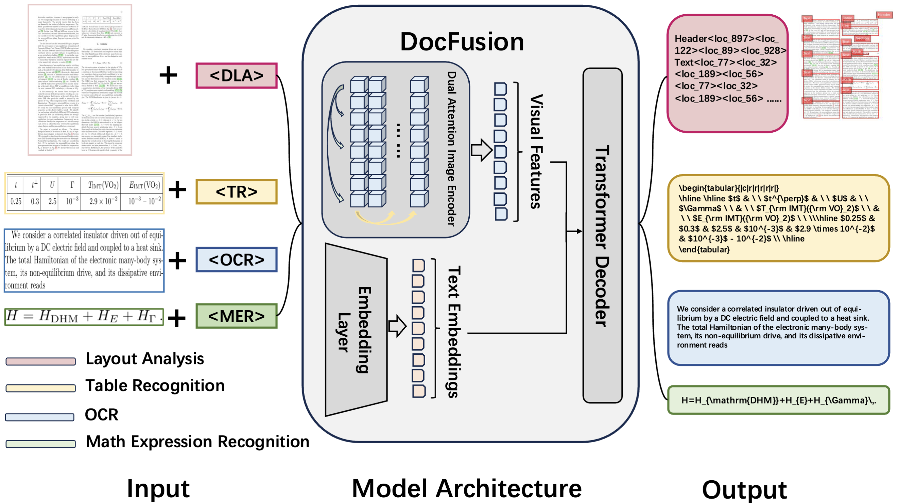

<div align="center">

<h1>DocFusion: A Unified Framework for Document Parsing Tasks</h1>

[](https://arxiv.org/abs/2412.12505) [](https://huggingface.co/sc22mc)

</div>

## Abstract

> Document parsing involves layout element detection and recognition, essential for extracting information. However, existing methods often employ multiple models for these tasks, leading to increased system complexity and maintenance overhead. While some models attempt to unify detection and recognition, they often fail to address the intrinsic differences in data representations, thereby limiting performance in document processing. Our research reveals that recognition relies on discrete tokens, whereas detection relies on continuous coordinates, leading to challenges in gradient updates and optimization. To bridge this gap, we propose the Gaussian-Kernel Cross-Entropy Loss (GK-CEL), enabling generative frameworks to handle both tasks simultaneously. Building upon GK-CEL, we propose DocFusion, a unified document parsing model with only 0.28B parameters. Additionally, we construct the DocLatex-1.6M dataset to provide high-quality training support. Experimental results show that DocFusion, equipped with GK-CEL, performs competitively across four core document parsing tasks, validating the effectiveness of our unified approach.

<p align="center">
  
</p>

## News 🚀🚀🚀

**2025.05.22** 🎉🎉  **DocLatex-1.6M dataset** is released on [🤗Huggingface](https://huggingface.co/datasets/juliozhao/DocSynth300K), a large-scale, high-quality dataset with 1.5M LaTeX-annotated math expressions and 100K tables.

**2025.05.21** 🎉🎉  **Paper** now available on [ArXiv](https://arxiv.org/abs/2412.12505).  

## Quick Start
### 1. Environment Setup
```bash
conda create -n docfusion python=3.10
conda activate docfusion
pip install -r requirements.txt
```
